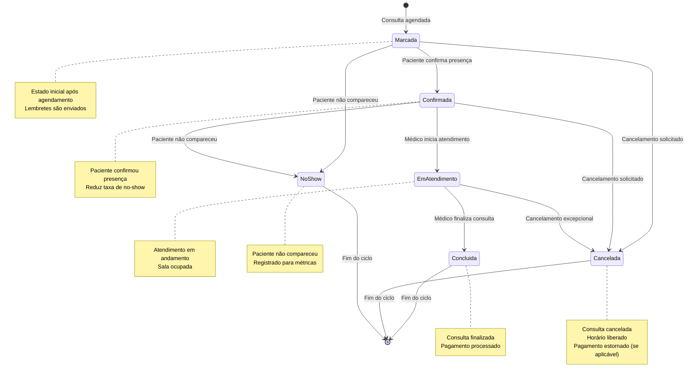
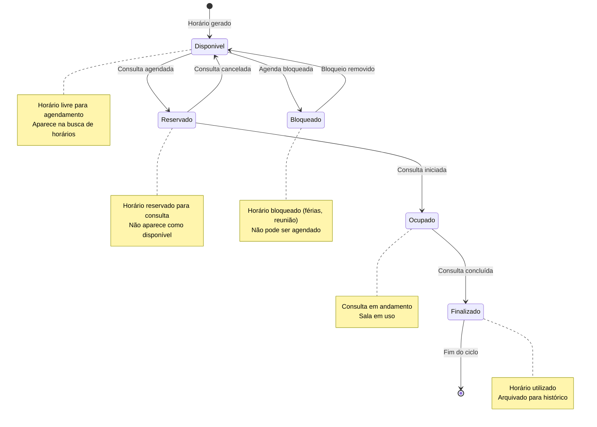
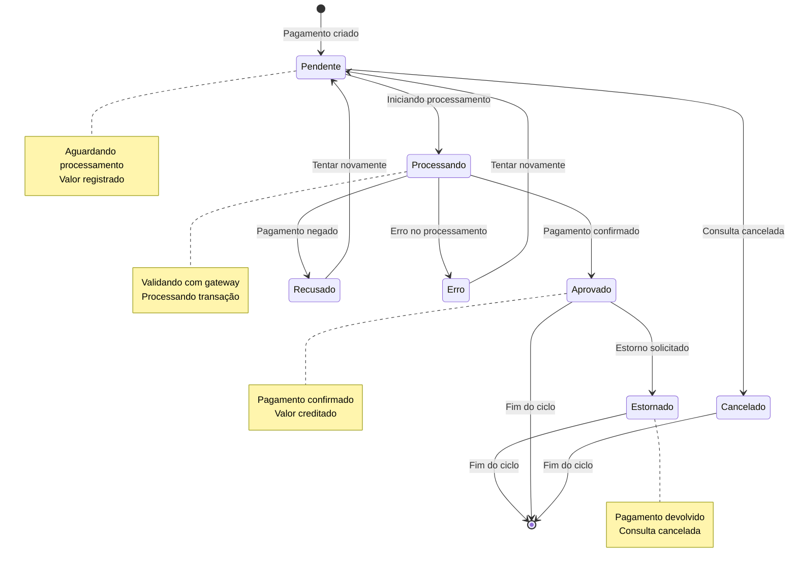
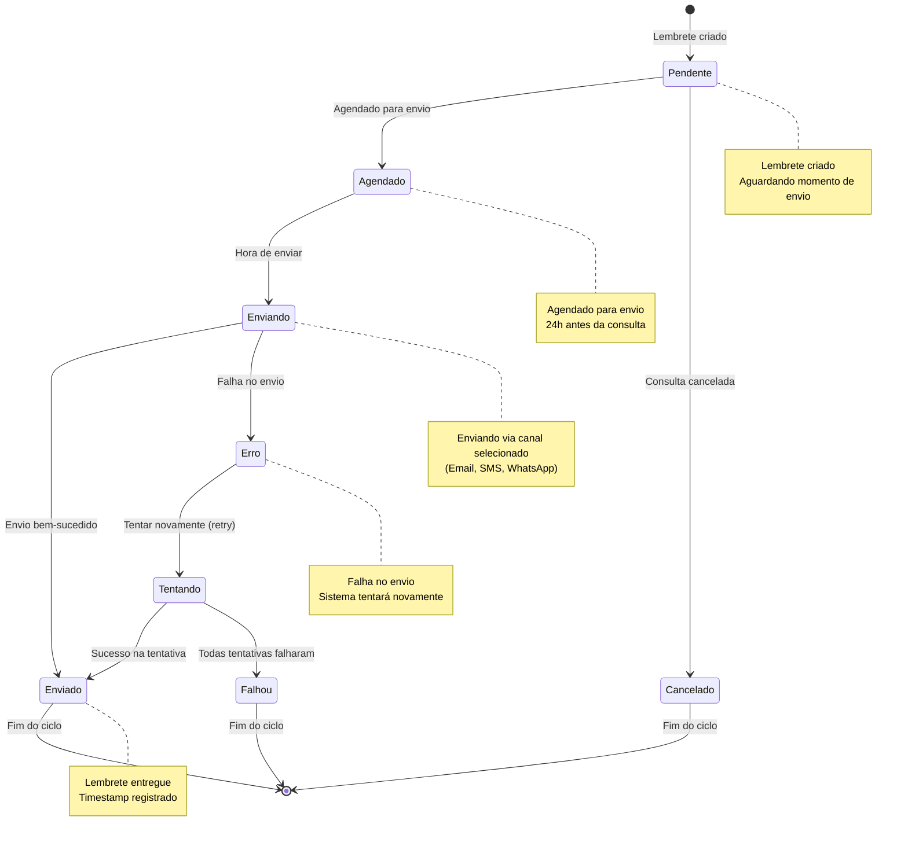
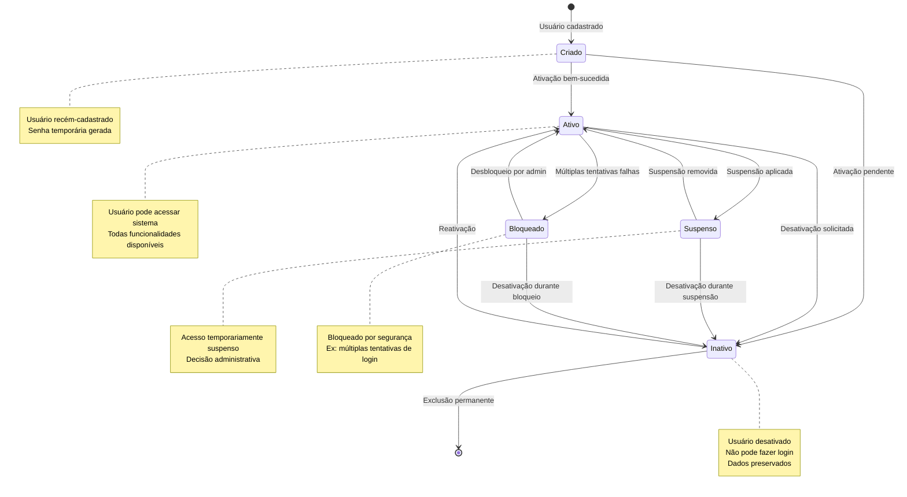
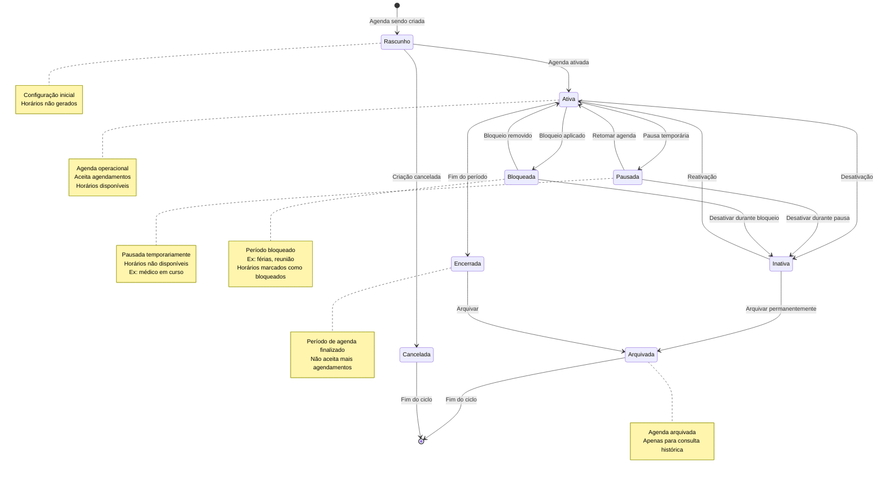
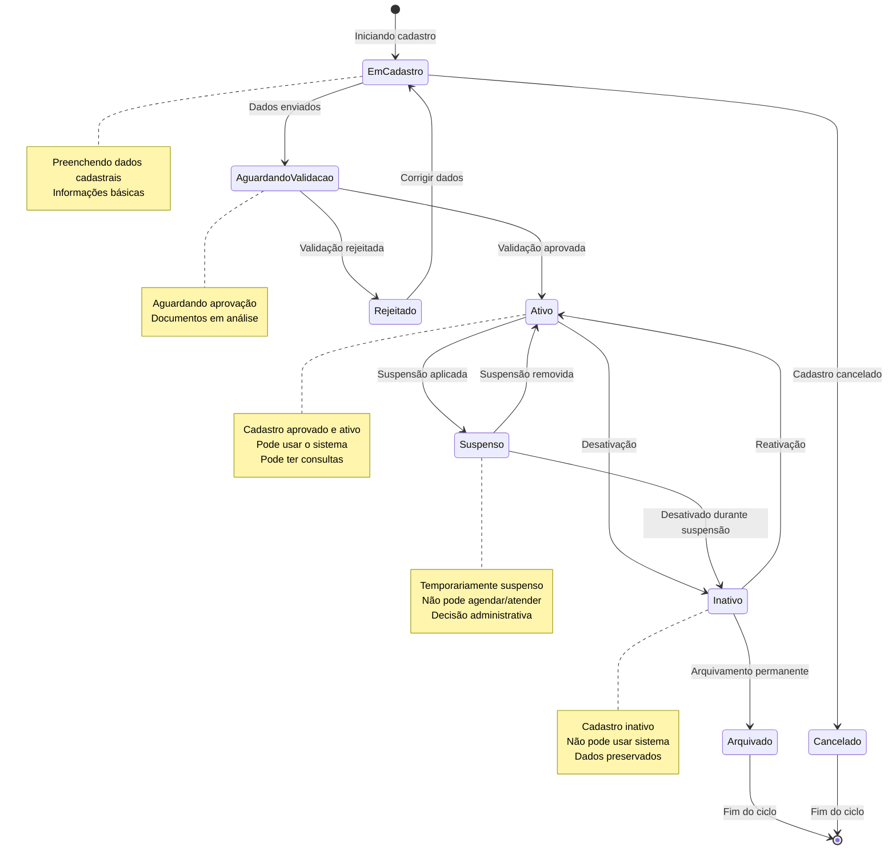
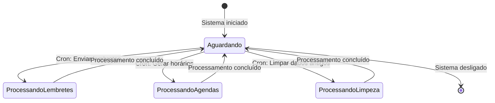

# 🔄 Diagramas de Estado

Este documento apresenta os diagramas de estado das principais entidades do sistema.

## 1. Diagrama de Estados: Consulta

## 2. Diagrama de Estados: Horário

## 3. Diagrama de Estados: Pagamento

## 4. Diagrama de Estados: Lembrete

## 5. Diagrama de Estados: Usuário

## 6. Diagrama de Estados: Agenda

## 7. Diagrama de Estados: Paciente/Médico (Status Cadastral)

## Transições de Estado - Regras de Negócio

### Consulta

| De | Para | Condição | Efeito |
|----|------|----------|--------|
| Marcada | Confirmada | Paciente confirma | Reduz probabilidade de no-show |
| Marcada | Cancelada | Qualquer ator cancela | Libera horário, estorna pagamento |
| Confirmada | Em Atendimento | Médico inicia | Marca início do atendimento |
| Em Atendimento | Concluída | Médico finaliza | Processa pagamento, finaliza ciclo |
| Confirmada | No-Show | Horário passou sem atendimento | Registra métrica, libera horário |

### Horário

| De | Para | Condição | Efeito |
|----|------|----------|--------|
| Disponível | Reservado | Consulta agendada | Remove da lista de disponíveis |
| Reservado | Disponível | Consulta cancelada | Retorna para lista de disponíveis |
| Reservado | Ocupado | Consulta iniciada | Marca como em uso |
| Disponível | Bloqueado | Bloqueio de agenda | Impede agendamentos |

### Pagamento

| De | Para | Condição | Efeito |
|----|------|----------|--------|
| Pendente | Processando | Início do processamento | Valida com gateway |
| Processando | Aprovado | Gateway confirma | Libera consulta |
| Aprovado | Estornado | Consulta cancelada | Devolve valor |
| Erro | Pendente | Retry automático | Nova tentativa |

## Eventos de Sistema

---

**Última atualização:** 15/11/2025
