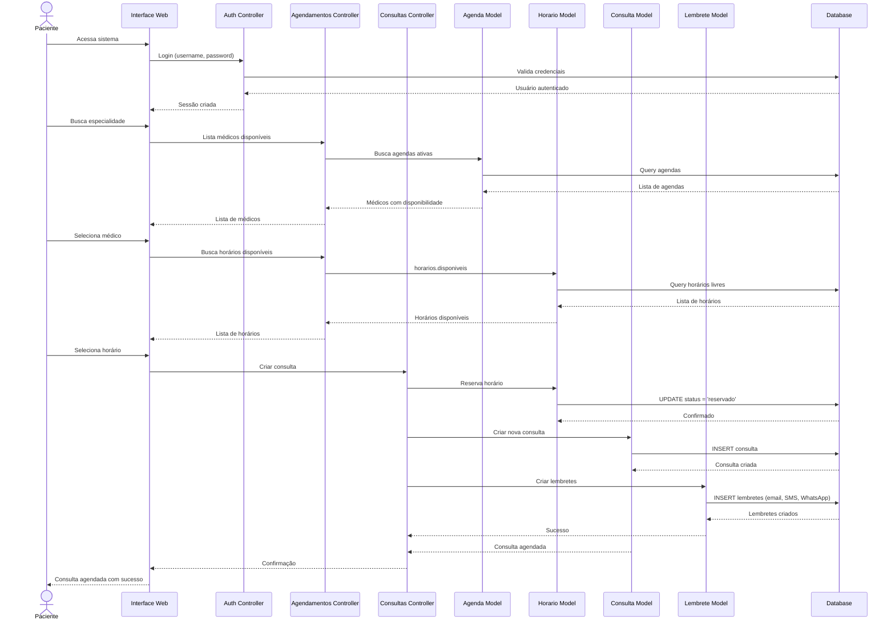
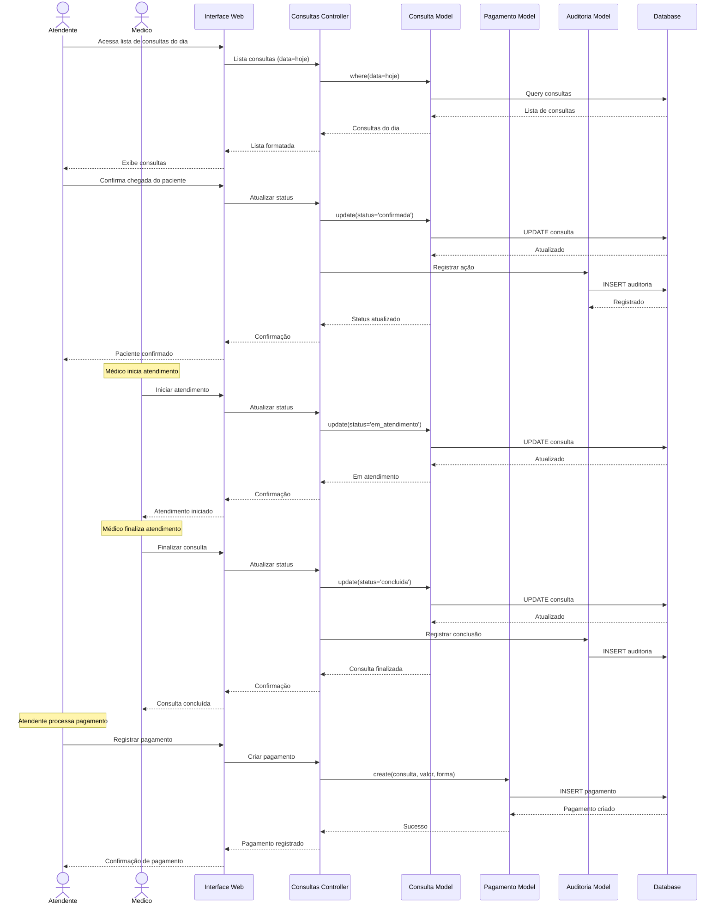
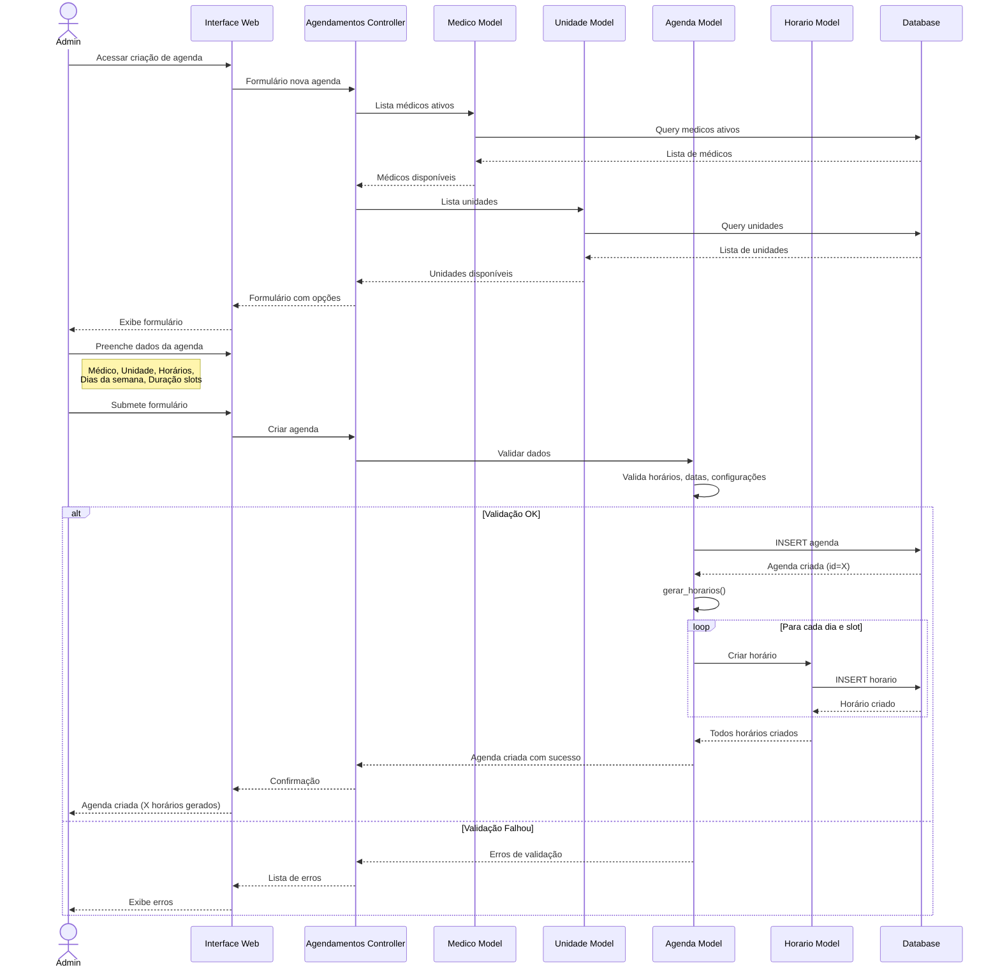
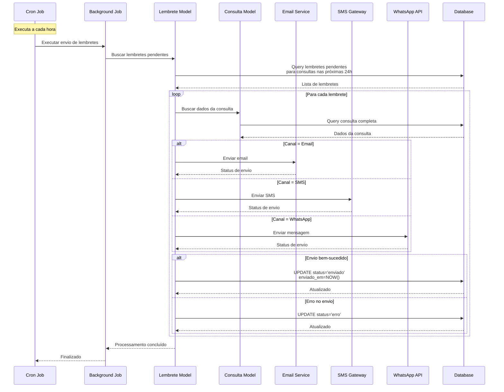
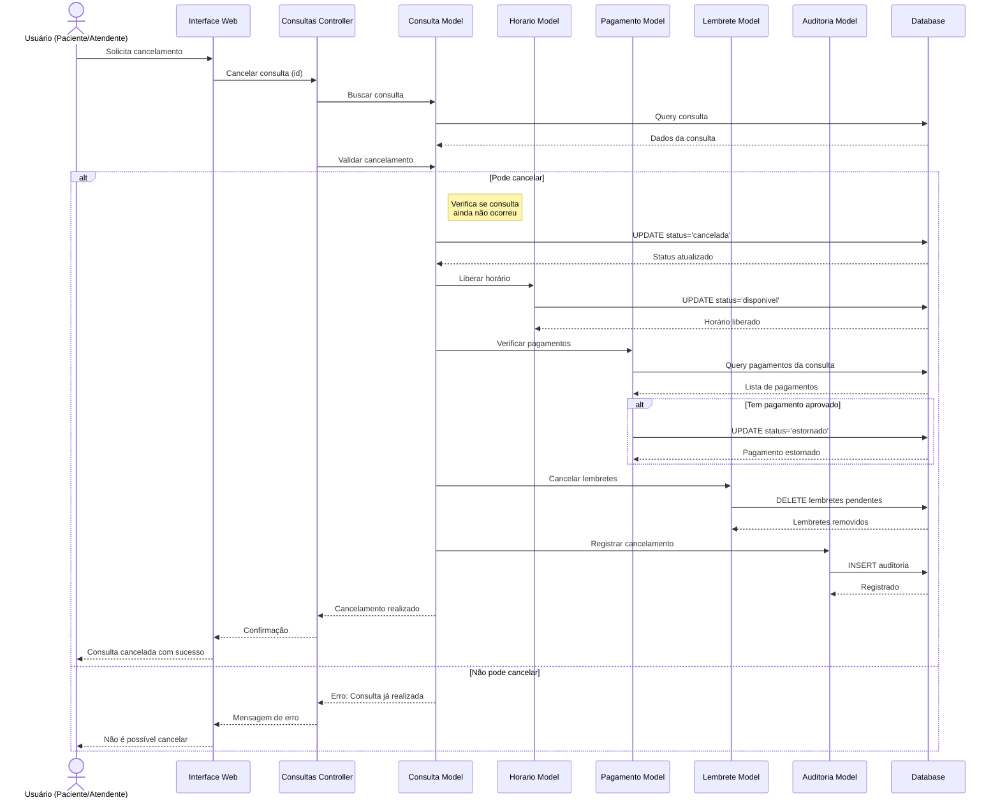
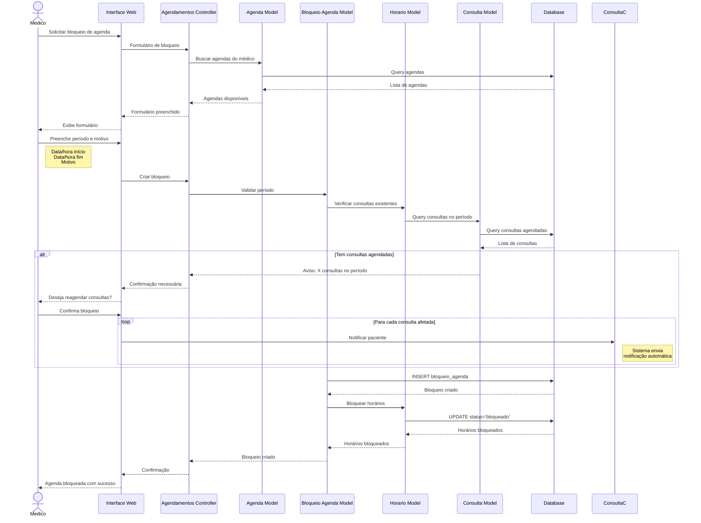
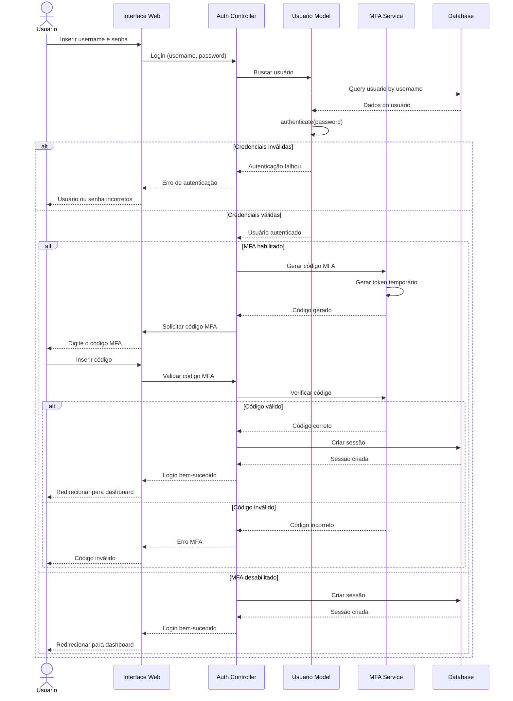

# 🔄 Diagramas de Sequência

Este documento contém os principais fluxos do sistema em diagramas de sequência.

## 1. Fluxo de Agendamento de Consulta

## 2. Fluxo de Atendimento de Consulta

## 3. Fluxo de Criação de Agenda

## 4. Fluxo de Envio de Lembretes

## 5. Fluxo de Cancelamento de Consulta

## 6. Fluxo de Bloqueio de Agenda

## 7. Fluxo de Autenticação com MFA

## Descrição dos Fluxos

### 1. Agendamento de Consulta
Fluxo completo desde a autenticação até a confirmação do agendamento, incluindo:
- Autenticação do paciente
- Busca de médicos e especialidades
- Verificação de disponibilidade
- Reserva de horário
- Criação de lembretes automáticos

### 2. Atendimento de Consulta
Processo de atendimento desde a confirmação da chegada até o pagamento:
- Confirmação de chegada
- Transição de status
- Registro de auditoria
- Processamento de pagamento

### 3. Criação de Agenda
Criação de agenda pelo administrador com geração automática de slots:
- Validação de dados
- Criação da agenda
- Geração automática de horários disponíveis

### 4. Envio de Lembretes
Processo automático de envio de notificações:
- Execução via cron job
- Múltiplos canais (Email, SMS, WhatsApp)
- Controle de status de envio

### 5. Cancelamento de Consulta
Fluxo completo de cancelamento com todas as implicações:
- Liberação de horário
- Estorno de pagamento
- Cancelamento de lembretes
- Registro de auditoria

### 6. Bloqueio de Agenda
Bloqueio temporário de agenda (férias, reuniões):
- Verificação de consultas existentes
- Notificação de pacientes afetados
- Bloqueio de horários

### 7. Autenticação com MFA
Processo de login com autenticação de dois fatores:
- Validação de credenciais
- Geração e validação de código MFA
- Criação de sessão

---

**Última atualização:** 15/11/2025
