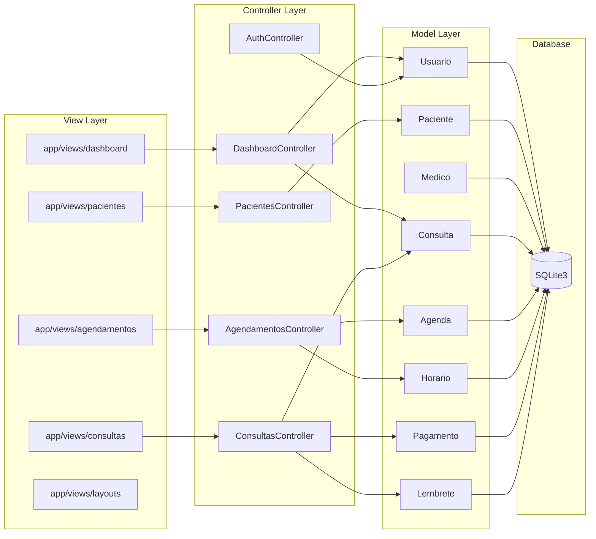
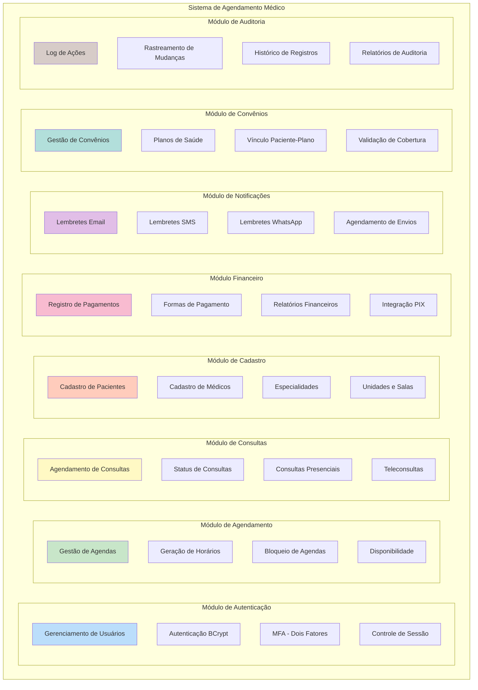
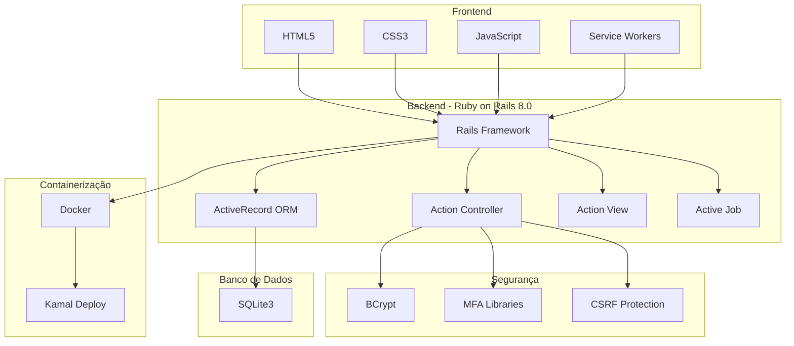
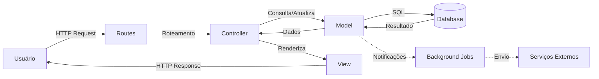

# 🏗️ Diagrama de Arquitetura do Sistema

Este diagrama mostra a arquitetura completa do sistema de agendamento médico.

## Arquitetura em Camadas

```mermaid
graph TB
    subgraph "Camada de Apresentação"
        WEB[Web Browser]
        MOBILE[Mobile App]
        PWA[Progressive Web App]
    end
    
    subgraph "Camada de API/Controladores"
        AUTH[Authentication Controller]
        DASHBOARD[Dashboard Controller]
        AGEND[Agendamentos Controller]
        CONSULT[Consultas Controller]
        PAC[Pacientes Controller]
        USER[Usuarios Controller]
        AJUDA[Ajuda Controller]
    end
    
    subgraph "Camada de Negócio/Models"
        USER_M[Usuario Model]
        PAC_M[Paciente Model]
        MED_M[Medico Model]
        CONS_M[Consulta Model]
        AGENDA_M[Agenda Model]
        HOR_M[Horario Model]
        PAG_M[Pagamento Model]
        LEM_M[Lembrete Model]
        AUD_M[Auditoria Model]
        CONV_M[Convenio Model]
        PLAN_M[Plano Model]
    end
    
    subgraph "Camada de Dados"
        DB[(SQLite Database)]
    end
    
    subgraph "Serviços Externos"
        EMAIL[Email Service]
        SMS[SMS Gateway]
        WHATS[WhatsApp API]
        PIX[PIX Payment Gateway]
    end
    
    WEB --> AUTH
    WEB --> DASHBOARD
    WEB --> AGEND
    WEB --> CONSULT
    WEB --> PAC
    
    MOBILE --> AUTH
    MOBILE --> AGEND
    MOBILE --> CONSULT
    
    PWA --> AUTH
    PWA --> DASHBOARD
    
    AUTH --> USER_M
    DASHBOARD --> CONS_M
    DASHBOARD --> PAC_M
    DASHBOARD --> MED_M
    
    AGEND --> AGENDA_M
    AGEND --> HOR_M
    AGEND --> CONS_M
    
    CONSULT --> CONS_M
    CONSULT --> PAG_M
    CONSULT --> LEM_M
    
    PAC --> PAC_M
    PAC --> PLAN_M
    
    USER --> USER_M
    USER --> AUD_M
    
    USER_M --> DB
    PAC_M --> DB
    MED_M --> DB
    CONS_M --> DB
    AGENDA_M --> DB
    HOR_M --> DB
    PAG_M --> DB
    LEM_M --> DB
    AUD_M --> DB
    CONV_M --> DB
    PLAN_M --> DB
    
    LEM_M -.-> EMAIL
    LEM_M -.-> SMS
    LEM_M -.-> WHATS
    
    PAG_M -.-> PIX
    
    style WEB fill:#e1f5ff
    style MOBILE fill:#e1f5ff
    style PWA fill:#e1f5ff
    
    style AUTH fill:#fff4e6
    style DASHBOARD fill:#fff4e6
    style AGEND fill:#fff4e6
    style CONSULT fill:#fff4e6
    style PAC fill:#fff4e6
    style USER fill:#fff4e6
    
    style USER_M fill:#e8f5e9
    style PAC_M fill:#e8f5e9
    style MED_M fill:#e8f5e9
    style CONS_M fill:#e8f5e9
    style AGENDA_M fill:#e8f5e9
    
    style DB fill:#f3e5f5
    
    style EMAIL fill:#ffebee
    style SMS fill:#ffebee
    style WHATS fill:#ffebee
    style PIX fill:#ffebee
```

## Arquitetura MVC Detalhada

## Componentes do Sistema

## Stack Tecnológico

## Fluxo de Dados

## Descrição dos Componentes

### Camada de Apresentação
- **Web Browser**: Interface web responsiva
- **Mobile App**: Aplicativo mobile (futuro)
- **PWA**: Progressive Web App com service workers

### Camada de Controladores
- **Auth Controller**: Autenticação e autorização
- **Dashboard Controller**: Painel principal
- **Agendamentos Controller**: Gestão de agendas
- **Consultas Controller**: Gerenciamento de consultas
- **Pacientes Controller**: Cadastro de pacientes
- **Usuarios Controller**: Administração de usuários

### Camada de Negócio
- **Models**: Lógica de negócio e validações
- **ActiveRecord**: ORM para acesso ao banco
- **Validações**: Regras de integridade
- **Scopes**: Consultas reutilizáveis

### Camada de Dados
- **SQLite3**: Banco de dados relacional
- **Migrations**: Controle de versão do schema
- **Seeds**: Dados iniciais

### Serviços Externos
- **Email Service**: Envio de notificações por email
- **SMS Gateway**: Envio de SMS
- **WhatsApp API**: Mensagens via WhatsApp
- **PIX Gateway**: Processamento de pagamentos

---

**Última atualização:** 15/11/2025
