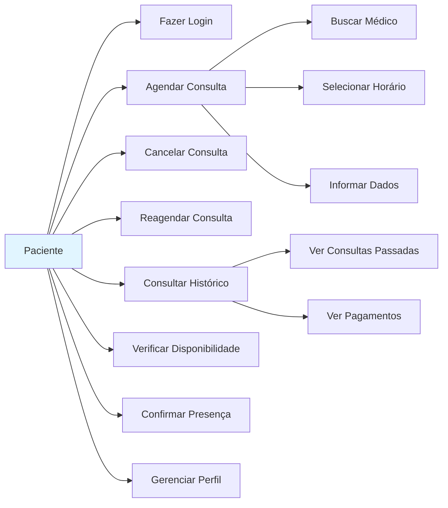
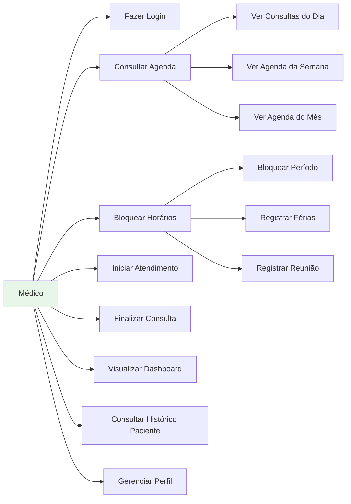
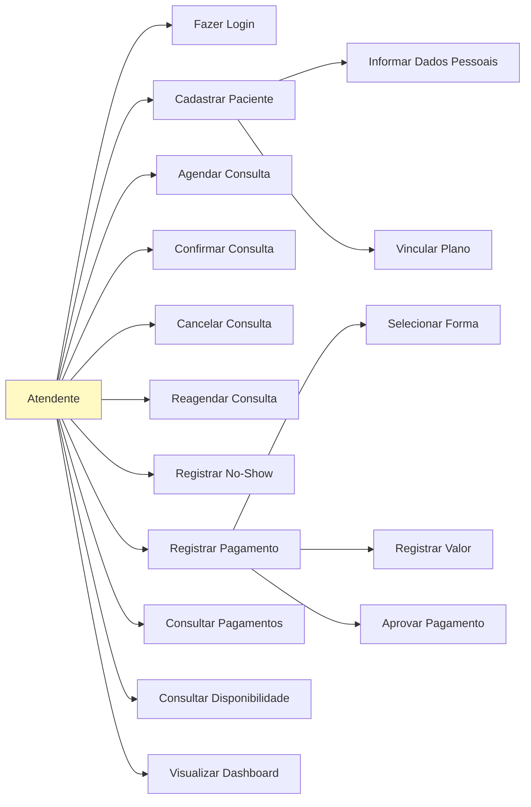
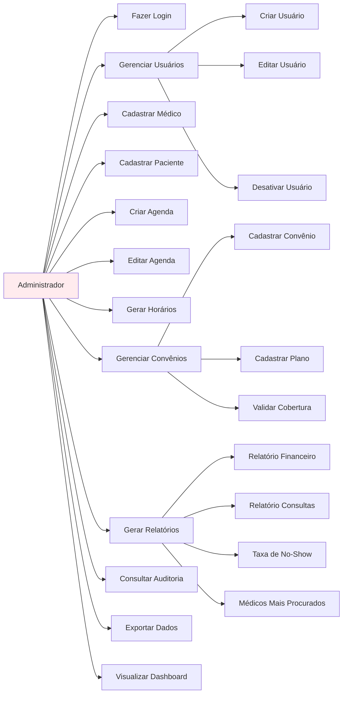
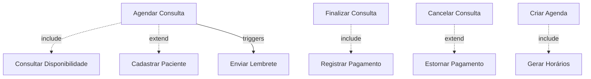

# 👥 Diagrama de Casos de Uso

Este documento apresenta os casos de uso do sistema organizados por tipo de usuário.

## Diagrama de Casos de Uso Geral

```mermaid
graph TB
    subgraph Sistema["Sistema de Agendamento Médico"]
        subgraph "Gestão de Usuários"
            UC1[Fazer Login]
            UC2[Fazer Logout]
            UC3[Gerenciar Perfil]
            UC4[Habilitar MFA]
        end
        
        subgraph "Gestão de Pacientes"
            UC5[Cadastrar Paciente]
            UC6[Atualizar Dados Paciente]
            UC7[Consultar Histórico]
            UC8[Vincular Plano de Saúde]
        end
        
        subgraph "Gestão de Médicos"
            UC9[Cadastrar Médico]
            UC10[Atualizar Dados Médico]
            UC11[Vincular Especialidades]
            UC12[Consultar Agenda]
        end
        
        subgraph "Gestão de Agendas"
            UC13[Criar Agenda]
            UC14[Editar Agenda]
            UC15[Bloquear Horários]
            UC16[Consultar Disponibilidade]
            UC17[Gerar Horários]
        end
        
        subgraph "Gestão de Consultas"
            UC18[Agendar Consulta]
            UC19[Confirmar Consulta]
            UC20[Cancelar Consulta]
            UC21[Reagendar Consulta]
            UC22[Iniciar Atendimento]
            UC23[Finalizar Consulta]
            UC24[Registrar No-Show]
        end
        
        subgraph "Gestão Financeira"
            UC25[Registrar Pagamento]
            UC26[Estornar Pagamento]
            UC27[Gerar Relatório Financeiro]
            UC28[Consultar Pagamentos]
        end
        
        subgraph "Notificações"
            UC29[Enviar Lembrete Email]
            UC30[Enviar Lembrete SMS]
            UC31[Enviar Lembrete WhatsApp]
            UC32[Confirmar Presença]
        end
        
        subgraph "Relatórios e Auditoria"
            UC33[Visualizar Dashboard]
            UC34[Gerar Relatórios]
            UC35[Consultar Auditoria]
            UC36[Exportar Dados]
        end
        
        subgraph "Gestão de Convênios"
            UC37[Cadastrar Convênio]
            UC38[Cadastrar Plano]
            UC39[Validar Cobertura]
            UC40[Consultar Planos Ativos]
        end
    end
    
    PACIENTE[👤 Paciente]
    MEDICO[👨‍⚕️ Médico]
    ATENDENTE[👩‍💼 Atendente]
    ADMIN[👨‍💻 Administrador]
    SISTEMA[🤖 Sistema]
    
    PACIENTE --> UC1
    PACIENTE --> UC2
    PACIENTE --> UC3
    PACIENTE --> UC18
    PACIENTE --> UC20
    PACIENTE --> UC21
    PACIENTE --> UC7
    PACIENTE --> UC32
    PACIENTE --> UC16
    
    MEDICO --> UC1
    MEDICO --> UC2
    MEDICO --> UC3
    MEDICO --> UC12
    MEDICO --> UC15
    MEDICO --> UC22
    MEDICO --> UC23
    MEDICO --> UC33
    MEDICO --> UC7
    
    ATENDENTE --> UC1
    ATENDENTE --> UC2
    ATENDENTE --> UC5
    ATENDENTE --> UC6
    ATENDENTE --> UC18
    ATENDENTE --> UC19
    ATENDENTE --> UC20
    ATENDENTE --> UC21
    ATENDENTE --> UC24
    ATENDENTE --> UC25
    ATENDENTE --> UC28
    ATENDENTE --> UC16
    ATENDENTE --> UC33
    
    ADMIN --> UC1
    ADMIN --> UC2
    ADMIN --> UC5
    ADMIN --> UC6
    ADMIN --> UC9
    ADMIN --> UC10
    ADMIN --> UC11
    ADMIN --> UC13
    ADMIN --> UC14
    ADMIN --> UC15
    ADMIN --> UC17
    ADMIN --> UC27
    ADMIN --> UC33
    ADMIN --> UC34
    ADMIN --> UC35
    ADMIN --> UC36
    ADMIN --> UC37
    ADMIN --> UC38
    ADMIN --> UC39
    
    SISTEMA --> UC29
    SISTEMA --> UC30
    SISTEMA --> UC31
    SISTEMA --> UC17
    
    style PACIENTE fill:#e1f5ff
    style MEDICO fill:#e8f5e9
    style ATENDENTE fill:#fff9c4
    style ADMIN fill:#ffebee
    style SISTEMA fill:#f3e5f5
```

## Casos de Uso por Ator

### 👤 Paciente

### 👨‍⚕️ Médico

### 👩‍💼 Atendente

### 👨‍💻 Administrador

## Descrições Detalhadas dos Casos de Uso

### UC18: Agendar Consulta

**Ator Principal:** Paciente, Atendente

**Pré-condições:**
- Usuário autenticado
- Médico com agenda ativa
- Horários disponíveis

**Fluxo Principal:**
1. Usuário seleciona especialidade desejada
2. Sistema exibe lista de médicos disponíveis
3. Usuário seleciona médico
4. Sistema exibe horários disponíveis
5. Usuário seleciona horário
6. Sistema solicita informações adicionais
7. Usuário confirma agendamento
8. Sistema cria consulta e lembretes
9. Sistema exibe confirmação

**Fluxos Alternativos:**
- 4a. Não há horários disponíveis
  - Sistema exibe mensagem informativa
  - Sugere outros médicos ou datas

**Pós-condições:**
- Consulta criada no sistema
- Horário reservado
- Lembretes agendados

---

### UC22: Iniciar Atendimento

**Ator Principal:** Médico

**Pré-condições:**
- Médico autenticado
- Consulta confirmada
- Paciente presente

**Fluxo Principal:**
1. Médico acessa lista de consultas do dia
2. Médico seleciona consulta
3. Médico visualiza dados do paciente
4. Médico inicia atendimento
5. Sistema atualiza status para "em_atendimento"
6. Sistema registra início do atendimento

**Pós-condições:**
- Status da consulta atualizado
- Horário de início registrado
- Auditoria registrada

---

### UC13: Criar Agenda

**Ator Principal:** Administrador

**Pré-condições:**
- Administrador autenticado
- Médico cadastrado
- Unidade disponível

**Fluxo Principal:**
1. Administrador acessa formulário de agenda
2. Administrador seleciona médico e unidade
3. Administrador define período (data início/fim)
4. Administrador define dias da semana
5. Administrador define horários (início/fim)
6. Administrador define duração dos slots
7. Administrador define política de intervalos
8. Sistema valida configurações
9. Sistema cria agenda
10. Sistema gera horários automaticamente
11. Sistema exibe confirmação

**Fluxos Alternativos:**
- 8a. Validação falha
  - Sistema exibe erros
  - Retorna ao passo 2

**Pós-condições:**
- Agenda criada
- Horários gerados e disponíveis
- Médico pode receber agendamentos

---

### UC25: Registrar Pagamento

**Ator Principal:** Atendente

**Pré-condições:**
- Atendente autenticado
- Consulta realizada
- Valor definido

**Fluxo Principal:**
1. Atendente acessa consulta
2. Atendente clica em "Registrar Pagamento"
3. Sistema exibe formulário de pagamento
4. Atendente informa valor
5. Atendente seleciona forma de pagamento
6. Sistema processa pagamento
7. Sistema registra pagamento
8. Sistema atualiza status
9. Sistema exibe confirmação

**Fluxos Alternativos:**
- 6a. Pagamento via PIX
  - Sistema gera QR Code
  - Aguarda confirmação
  - Atualiza status automaticamente

**Pós-condições:**
- Pagamento registrado
- Status atualizado
- Auditoria registrada

---

### UC35: Consultar Auditoria

**Ator Principal:** Administrador

**Pré-condições:**
- Administrador autenticado

**Fluxo Principal:**
1. Administrador acessa módulo de auditoria
2. Administrador define filtros (entidade, usuário, período)
3. Sistema busca registros de auditoria
4. Sistema exibe lista de ações
5. Administrador seleciona registro
6. Sistema exibe detalhes da ação
7. Sistema exibe diferenças (diffs)

**Pós-condições:**
- Informações de auditoria visualizadas

---

## Relacionamentos entre Casos de Uso

**Legenda:**
- `-.->|include|`: Relacionamento de inclusão (sempre executado)
- `-.->|extend|`: Relacionamento de extensão (executado condicionalmente)
- `-->|triggers|`: Dispara ação (automática)

---

## Matriz de Permissões

| Caso de Uso | Paciente | Médico | Atendente | Admin |
|-------------|----------|--------|-----------|-------|
| Fazer Login | ✓ | ✓ | ✓ | ✓ |
| Agendar Consulta | ✓ | ✗ | ✓ | ✓ |
| Cancelar Consulta | ✓ | ✗ | ✓ | ✓ |
| Iniciar Atendimento | ✗ | ✓ | ✗ | ✗ |
| Finalizar Consulta | ✗ | ✓ | ✗ | ✗ |
| Cadastrar Paciente | ✗ | ✗ | ✓ | ✓ |
| Cadastrar Médico | ✗ | ✗ | ✗ | ✓ |
| Criar Agenda | ✗ | ✗ | ✗ | ✓ |
| Bloquear Horários | ✗ | ✓ | ✗ | ✓ |
| Registrar Pagamento | ✗ | ✗ | ✓ | ✓ |
| Gerar Relatórios | ✗ | ✗ | ✗ | ✓ |
| Consultar Auditoria | ✗ | ✗ | ✗ | ✓ |
| Enviar Lembretes | Sistema Automático | | | |

---

**Última atualização:** 15/11/2025
