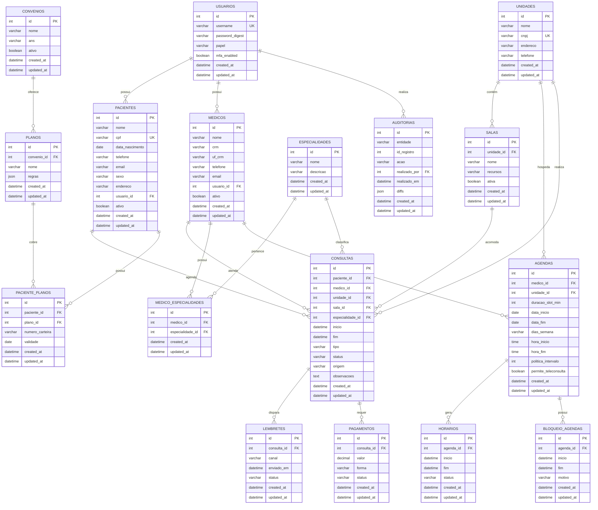

# 📊 Diagrama de Entidade-Relacionamento (ERD)

Este diagrama mostra todas as entidades do banco de dados e seus relacionamentos.

## Diagrama ER Completo

## Legenda

- **PK**: Primary Key (Chave Primária)
- **FK**: Foreign Key (Chave Estrangeira)
- **UK**: Unique Key (Chave Única)
- **||--o{**: Relacionamento Um-para-Muitos
- **||--||**: Relacionamento Um-para-Um

## Cardinalidades

| Relacionamento | Descrição |
|----------------|-----------|
| Usuario → Paciente | Um usuário pode ter um paciente (1:1) |
| Usuario → Medico | Um usuário pode ter um médico (1:1) |
| Paciente → Consultas | Um paciente pode ter várias consultas (1:N) |
| Medico → Consultas | Um médico pode atender várias consultas (1:N) |
| Medico → Especialidades | Um médico pode ter várias especialidades (N:M) |
| Medico → Agendas | Um médico pode ter várias agendas (1:N) |
| Unidade → Salas | Uma unidade pode ter várias salas (1:N) |
| Agenda → Horarios | Uma agenda pode gerar vários horários (1:N) |
| Consulta → Lembretes | Uma consulta pode ter vários lembretes (1:N) |
| Consulta → Pagamentos | Uma consulta pode ter vários pagamentos (1:N) |
| Paciente → Planos | Um paciente pode ter vários planos (N:M) |
| Convenio → Planos | Um convênio oferece vários planos (1:N) |

---

**Última atualização:** 15/11/2025
