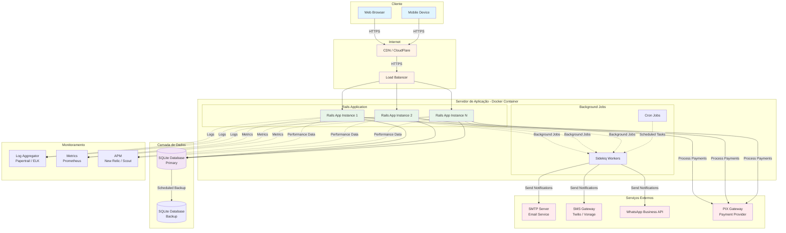
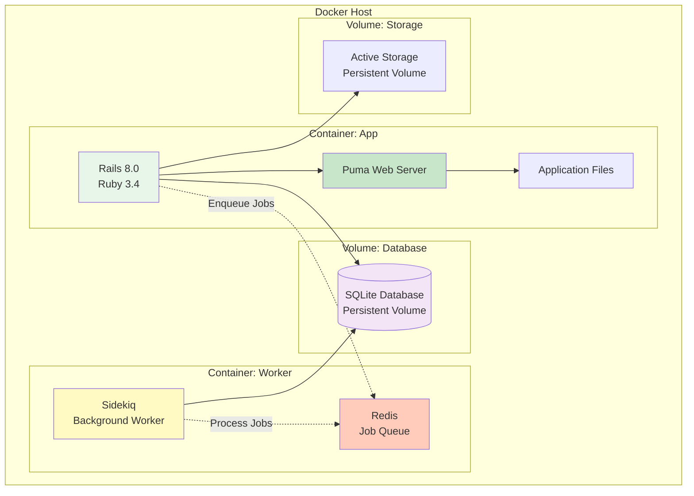
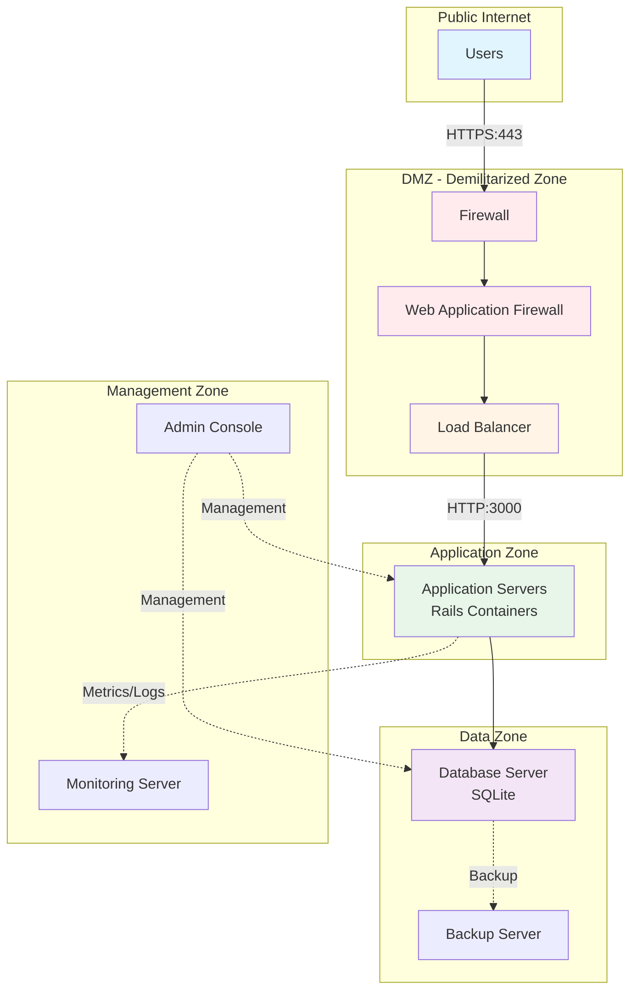
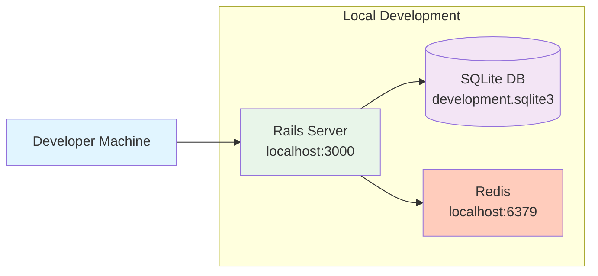
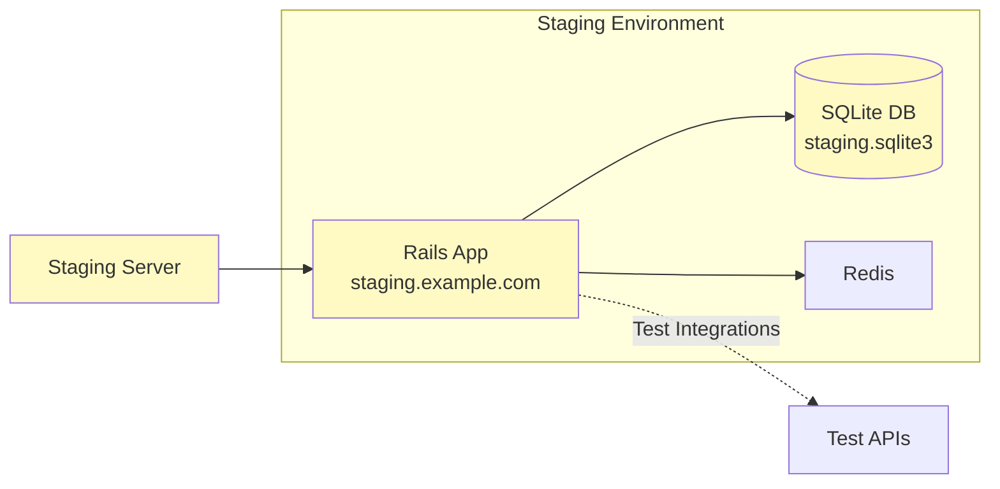
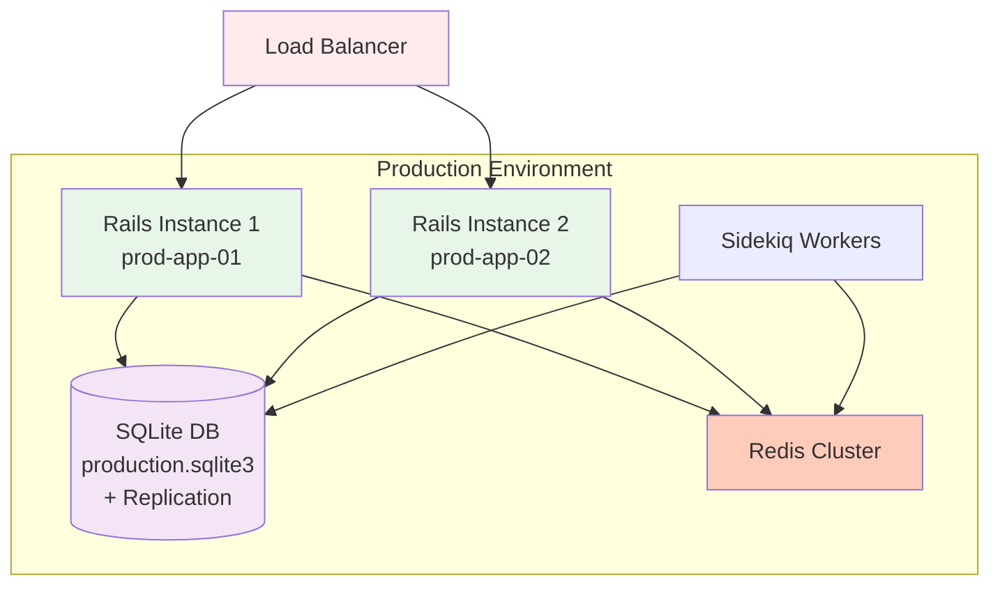
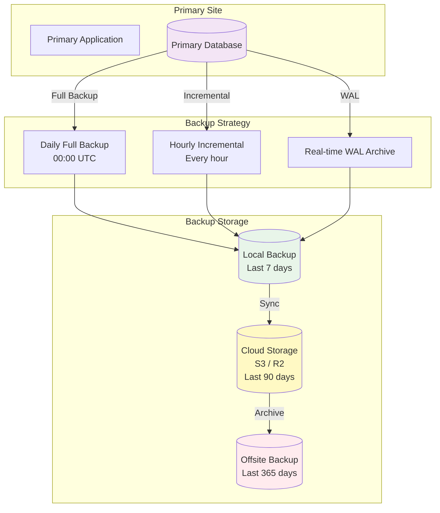
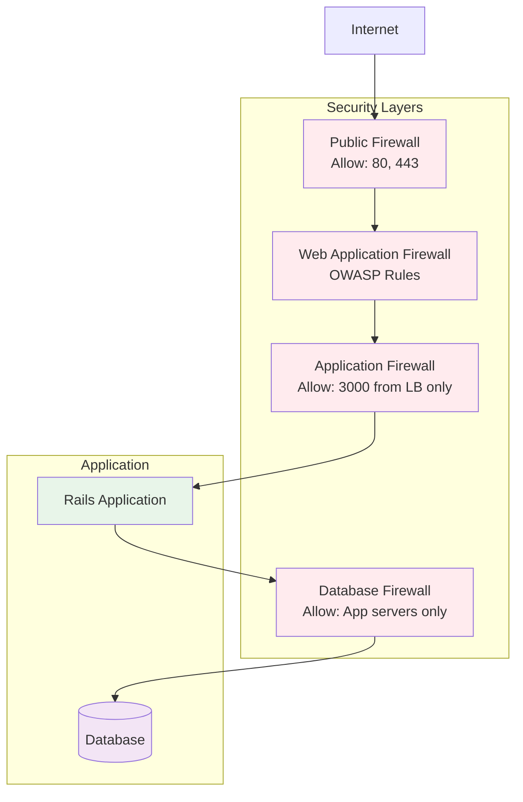
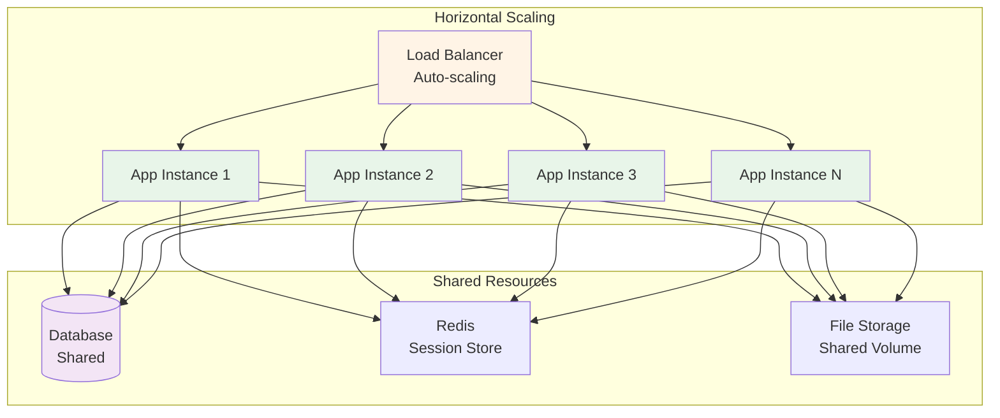

# 🚀 Diagrama de Implantação (Deployment)

Este documento apresenta a arquitetura de implantação do sistema.

## Diagrama de Implantação - Produção

## Arquitetura de Container (Docker)

## Deployment com Kamal

```mermaid
graph LR
    subgraph "Development"
        DEV[Developer Machine]
        GIT[Git Repository<br/>GitHub]
    end
    
    subgraph "CI/CD Pipeline"
        ACTIONS[GitHub Actions]
        BUILD[Build Docker Image]
        TESTS[Run Tests]
        PUSH[Push to Registry]
    end
    
    subgraph "Docker Registry"
        REGISTRY[Docker Registry<br/>GitHub Container Registry]
    end
    
    subgraph "Production Server"
        KAMAL[Kamal Deploy]
        DOCKER[Docker Engine]
        CONTAINERS[Running Containers]
    end
    
    DEV -->|git push| GIT
    GIT -->|trigger| ACTIONS
    ACTIONS --> BUILD
    BUILD --> TESTS
    TESTS --> PUSH
    PUSH --> REGISTRY
    
    REGISTRY -->|kamal deploy| KAMAL
    KAMAL --> DOCKER
    DOCKER --> CONTAINERS
    
    style DEV fill:#e1f5ff
    style ACTIONS fill:#fff4e6
    style REGISTRY fill:#e8f5e9
    style KAMAL fill:#f3e5f5
```

## Infraestrutura de Rede

## Configuração de Ambiente

### Desenvolvimento

### Homologação / Staging

### Produção

## Backup e Disaster Recovery

## Segurança e Firewall

## Escalabilidade

## Especificações Técnicas

### Servidor de Aplicação

| Componente | Especificação |
|------------|---------------|
| OS | Linux (Ubuntu 22.04 LTS) |
| Runtime | Ruby 3.4.x |
| Framework | Rails 8.0.3 |
| Web Server | Puma (5 workers, 5 threads) |
| Container | Docker |
| Deploy | Kamal |

### Banco de Dados

| Componente | Especificação |
|------------|---------------|
| Database | SQLite3 |
| Storage | SSD (Persistent Volume) |
| Backup | Daily full + Hourly incremental |
| Replication | File-based replication |

### Performance

| Métrica | Valor |
|---------|-------|
| Response Time (p95) | < 200ms |
| Response Time (p99) | < 500ms |
| Throughput | ~1000 req/s |
| Uptime SLA | 99.9% |

### Capacidade

| Recurso | Capacidade |
|---------|------------|
| Concurrent Users | ~5000 |
| Database Size | ~100GB |
| Daily Transactions | ~50k consultas |
| API Rate Limit | 100 req/min per user |

---

**Última atualização:** 15/11/2025
